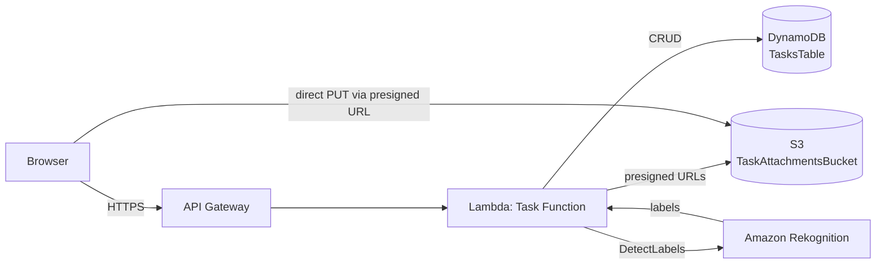

# ServerTask

A serverless to-do application with image recognition, built entirely on AWS managed services using AWS CDK. Tasks can have image attachments that are automatically labeled using Amazon Rekognition.

**Status:** Functional demo — core task management, image upload, and AI labeling all working end-to-end.

## Features

- Create, read, update, and delete tasks (title, description, due date, status)
- Attach an image to any task, at creation or afterward
- Automatic image labeling via Amazon Rekognition (e.g. a logo photo gets tagged "Logo", "Symbol", etc.)
- Data persists in DynamoDB — tasks survive across browser sessions and devices, not just local storage
- Clean, responsive UI built with React + Material UI

## Architecture



**Request flow for a task with an image:**
1. Frontend calls `POST /tasks` — Lambda writes the task to DynamoDB and, if an image is expected, returns a pre-signed S3 upload URL
2. Frontend uploads the image directly to S3 using that URL (bypassing Lambda entirely, for speed and to avoid proxying large files through API Gateway)
3. Frontend calls `POST /tasks/{taskId}/process-image` — Lambda runs Rekognition's `DetectLabels` directly against the S3 object and writes the resulting labels back to the task record
4. Reads (`GET /tasks`, `GET /tasks/{taskId}`) return a short-lived pre-signed **view** URL for the image, since the S3 bucket itself is private

## Tech Stack

| Layer | Technology |
|---|---|
| Frontend | React, TypeScript, Material UI, React Router, Axios |
| API | Amazon API Gateway (REST) |
| Compute | AWS Lambda (Node.js 20) |
| Database | Amazon DynamoDB (on-demand billing) |
| Storage | Amazon S3 (pre-signed URLs, CORS-enabled) |
| Image AI | Amazon Rekognition |
| Infrastructure as Code | AWS CDK (TypeScript) |

## API Endpoints

| Method | Path | Description |
|---|---|---|
| `POST` | `/tasks` | Create a task |
| `GET` | `/tasks?userId=` | List a user's tasks |
| `GET` | `/tasks/{taskId}?userId=` | Get a single task |
| `PUT` | `/tasks/{taskId}` | Update a task (title, description, due date, status, or request a new image upload URL) |
| `DELETE` | `/tasks/{taskId}?userId=` | Delete a task |
| `POST` | `/tasks/{taskId}/process-image` | Trigger Rekognition analysis on the task's uploaded image |

## Setup

### Prerequisites
- Node.js 18+ and npm
- AWS CLI configured with a profile that has permissions to deploy CloudFormation, IAM, DynamoDB, S3, Lambda, API Gateway, and Rekognition resources
- AWS CDK bootstrapped in your target account/region (`npx aws-cdk bootstrap --profile <your-profile>`)

### Deploy the backend

```bash
npm install
npx aws-cdk deploy --profile <your-profile>
```

Note the `TaskApiEndpoint` output — you'll need it for the frontend.

### Run the frontend

```bash
cd frontend
npm install
```

Set `REACT_APP_API_URL` in `frontend/.env` to the deployed API endpoint, then:

```bash
npm start
```

The app runs at `http://localhost:3000`.

## Known Limitations / Scope Notes

- **No authentication layer.** There's no Cognito (or similar) in this stack, so `userId` is passed explicitly by the client rather than derived from a verified identity. A production version would add Cognito and pull `userId` from the API Gateway authorizer context.
- **Dev-friendly removal policies.** DynamoDB and S3 resources use `RemovalPolicy.DESTROY` (and S3 has `autoDeleteObjects: true`), so `cdk destroy` fully tears down the stack including data. This is intentional for a portfolio/demo project — a production deployment would use `RETAIN`.

## Estimated Cost

This stack is entirely pay-per-use, so at portfolio-demo traffic levels (a handful of users, light usage) it runs at effectively **$0–1/month**, within AWS free tier limits for most of these services:
- DynamoDB (on-demand): free tier covers 25 GB storage + significant read/write capacity
- Lambda: 1M free requests/month
- API Gateway: charges per request beyond a small free tier, negligible at low volume
- S3: pennies for the small amount of image storage a demo would use
- Rekognition: 5,000 free images/month for the first year, then ~$1 per 1,000 images

At real production scale (thousands of active users), the cost driver would shift to Rekognition calls and API Gateway requests — both scale linearly and predictably, which is the main cost-related argument for this architecture over a fixed-capacity server.
